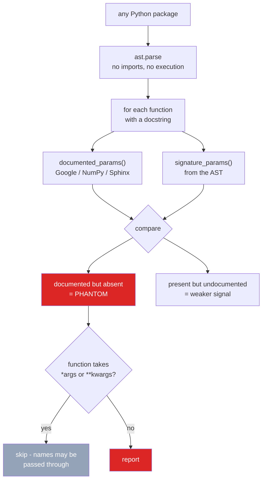

# docstring-drift

**101 documented parameters across eight major Python libraries do not exist on the
function they describe.**

Rename a parameter and nothing fails. No test breaks, no linter complains, no type
checker objects — the docstring simply keeps describing a function that no longer
exists. This finds those cases by comparing what a docstring *claims* the parameters
are against what the signature *actually says*.

Pure AST analysis: no imports, no execution, no model, no network. Safe to run over
third-party code you did not write, and deterministic.

---

## Measured result

Scanned the installed source of eight widely used packages:

| Package | files | functions | documenting params | **phantom** | undocumented |
|---|---|---|---|---|---|
| pandas | 1,421 | 28,295 | 1,653 | **40** | 187 |
| scipy | 988 | 24,004 | 1,953 | **27** | 1,015 |
| huggingface_hub | 183 | 1,937 | 399 | **13** | 49 |
| scikit-learn | 671 | 11,158 | 1,665 | **9** | 73 |
| numpy | 407 | 11,215 | 761 | **8** | 258 |
| altair | 55 | 2,507 | 118 | **3** | 12 |
| PIL | 97 | 1,228 | 205 | **1** | 13 |
| streamlit | 376 | 3,415 | 486 | **0** | 18 |
| **Total** | **4,198** | **83,759** | **7,240** | **101** | **1,625** |

**Phantom rate: 101 / 7,240 = 1.40%** of every function that documents its parameters.

### A verified example

`pandas/_testing/_io.py`, `round_trip_pickle`:

```python
def round_trip_pickle(obj, tmp_path):     # <- parameter is tmp_path
    """
    Parameters
    ----------
    obj : any object
        The object to pickle and then re-read.
    path : str, path object or file-like object, default None    # <- documents `path`
        The path where the pickled object is written and then read.
    """
```

The parameter was renamed to `tmp_path`; the docstring still documents `path`. Nothing
in the toolchain noticed.

---

## What it reports

**Phantom** — the docstring documents a name the signature does not contain. This is
the headline: it is almost always a rename or a removal that the docs missed.

**Undocumented** — a real parameter with no entry in a docstring that documents the
others. Reported separately and **never counted toward the phantom rate**, because
omitting a parameter is frequently deliberate.

---

## False positives it does *not* produce

The first version of this scanner reported **~400 phantom parameters in scipy alone**.
Almost none were real. Each cause is now fixed, and each has a regression test:

| Cause | Example | Fix |
|---|---|---|
| Prose parsed as a parameter | `Default: None` inside a description became a parameter called `Default` | parameter names sit at one indent; descriptions are indented further |
| Catch-all signatures | `numpy.einsum` documents `dtype` and `casting`, both passed through `**kwargs` | functions with `*args`/`**kwargs` are exempt from phantom reporting |
| `self` / `cls` | stripped from signatures but not from docstrings, so documenting `cls` looked phantom | ignored on both sides |

After those fixes scipy went from **434 → 27**. The numbers in this README are the
post-fix ones, and one finding was verified by hand against the source before publishing.

---

## Use it

```bash
python src/drift.py <path>      # scan any directory of Python
streamlit run ui/app.py         # interactive: pick packages, inspect findings
pytest -q                       # 20 tests, no network
```

It works as a CI check — it needs no dependencies beyond the standard library, imports
nothing from the code it scans, and exits deterministically.

## Supported docstring styles

Google (`Args:`), NumPy (`Parameters\n----------`), and Sphinx (`:param name:`).

## Limitations

- **Only parameter names.** It does not check types, descriptions, return values, or
  whether a description is still accurate — those need more than AST comparison.
- **`*args`/`**kwargs` functions are exempt from phantom detection**, so drift in a
  `**kwargs`-heavy API is invisible here. That is a deliberate precision-over-recall
  trade: a false positive in a linter is far more costly than a miss.
- **The scan covers installed source**, so results depend on the versions present.

---

## How it works



---

## Problems hit while building this

**The first version reported roughly 400 phantom parameters in scipy alone, and almost
none were real.** Finding and removing those was most of the work.

| Problem | What happened | Fix |
|---|---|---|
| **Prose parsed as parameters** | `Default: None` inside a description matched the name pattern and became a parameter called `Default`. This alone caused most of the scipy noise | Track the indent of the first entry in a section; anything indented further is a description, not a name |
| **Catch-all signatures** | `numpy.einsum` documents `dtype` and `casting`, both legitimately passed through `**kwargs`, and both were reported as phantom | Functions taking `*args`/`**kwargs` are exempt from phantom reporting |
| **`self` / `cls` asymmetry** | Stripped from signatures but not from docstrings, so documenting `cls` looked like a phantom | Ignored on both sides |
| **Trusting the first run** | The initial numbers looked publishable and were wrong | Spot-checked a finding against real source before writing any number down - which is how the pandas case was confirmed |

After those fixes **scipy went from 434 to 27**. Every class has a regression test.

---

## Future work

1. **Check types, not just names** - a docstring claiming `int` for a `str` parameter is
   the same class of defect.
2. **Detect stale descriptions**, not just stale names. That needs more than AST
   comparison, and is where a language model would genuinely earn its place.
3. **Recover recall on `**kwargs` APIs.** They are currently exempt, so drift in a
   kwargs-heavy library is invisible. Resolving forwarded kwargs would close the gap.
4. **Return values and raised exceptions** - `Returns:` and `Raises:` sections drift too.
5. **Ship as a pre-commit hook and GitHub Action**, with a `--fail-under` threshold.
6. **Scan the top 1,000 PyPI packages** to find out whether 1.40% is typical or whether
   these eight happen to be unusual.
7. **Correlate drift with commit history** to measure how long a docstring stays wrong.

---

## Stack

`Python 3.11+` · `ast` (standard library) · `Streamlit` · `Altair` · `pandas` ·
`pytest` · `ruff` · `GitHub Actions` - **zero runtime dependencies** for the scanner

## Keywords

docstring linter · documentation drift · stale documentation · Python AST · static
analysis · code quality · documentation testing · pydocstyle alternative · darglint
alternative · Google style docstrings · NumPy docstrings · Sphinx docstrings ·
technical debt · pre-commit hook · CI linting · developer tooling

## Layout

```
src/drift.py     parsing, comparison, scanning
ui/app.py        Streamlit dashboard (scans live, nothing precomputed)
tests/           20 tests, including one per false-positive class
```
